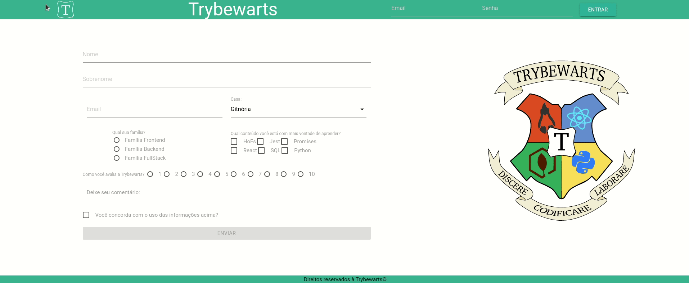

<h1>Bem vindo ao repositório do projeto Trybewarts</h1>

<h3>English Version Avaiable soon</h3>

<h2>Introdução</h2>

  Esse projeto foi o meu Número #5 dos meus projetos realizados no Curso de Desenvolvimento Web da Trybe e Meu primeiro projeto em Pair Programming. Ele foi realizado com meu companheiro Andrey Visniewski.

  Será desenvolvido um site utilizando `HTML`, `CSS`, `Forms` e `Frameworks-CSS`. O framework escolhido por mim foi o `Materialize`.

  As competências avaliadas nesse projeto foram:
  1- Manipular CSS
  2- Manipular HTML
  3- Manipular Formulários
  4- Manipular Bibliotecas de Framework

<h2>Resultado</h2>

<h2>Requisitos</h2>

### 1. Crie uma barra verde na parte superior da página
#### O que será verificado:

* Existe um elemento com a classe `header`
* O elemento possui a propriedade CSS `display: flex`
* O elemento possui a propriedade CSS `background-color: rgb(50, 167, 145)`

### 2. Adicione o logotipo da Trybewarts com a classe `trybewarts-header-logo` na barra superior
#### O que será verificado:

* Existe um elemento `img` com a classe `trybewarts-header-logo`
* O elemento possui o atributo `src` apontando para `images/trybewarts-header-logo.svg`

### 3. Acrescente um formulário de login no canto direito da barra superior contendo os inputs de email, senha e um botão de login
#### O que será verificado:

* Existe um elemento `form` com a classe `trybewarts-login`
* Existe um input com o atributo `name` igual a **email** e o `placeholder` igual a **Email**
* Existe um input com o atributo `name` igual a **password** e o `placeholder` igual a **Senha**
* Existe um botão com o texto **"Entrar"**
* O formulário possui a propriedade CSS `display: flex`
* O elemento `form` está à direita da logo
* Ao clicar no botão de login dispara um alert com o texto **"Email ou senha inválidos"**, no caso de erro de preenchimento dos dados
* Ao clicar no botão de login dispara um alert com o texto **"Olá, Tryber!"**, no caso de preenchimento correto dos dados.

### 4. Crie um título com o texto `Trybewarts` centralizado dentro do `Header`
#### O que será verificado:

* Existe um elemento `h1` com o id `trybewarts-header-title` e com o texto `Trybewarts`
* O elemento com a classe `header` deve possuir exatos `3` elementos filhos
* O filho do meio do elemento com a classe `header` deve ser o título h1 `Trybewarts`

### 5. Adicione um formulário no corpo da página
#### O que será verificado:

* Existe um elemento `form` com o id `evaluation-form`
* O elemento `form` está dentro da tag `main`
* O elemento `main` e o `form` possuem a propriedade CSS `display: flex`
* O elemento `form` possui a propriedade CSS `width: 675px`

### 6. Faça com que o eixo principal do formulário seja vertical
#### O que será verificado:

* O elemento `evaluation-form` possui a propriedade CSS `flex-direction: column`

### 7. Adicione a logo da Trybewarts no lado direito da página
#### O que será verificado:

* Existe um elemento `img` com o id `trybewarts-forms-logo`
* O elemento possui o atributo `src` apontando para `images/trybewarts-colored.svg`
* A imagem possui o estilo css `height` igual a `500px`

### 8. Acrescente ao formulário com id `evaluation-form` os inputs de `nome, sobrenome e email`
#### O que será verificado:

* Existe um input com o id **input-name** e placeholder **Nome**
* Existe um input com o id **input-lastname** e placeholder **Sobrenome**
* Existe um input com o id **input-email** e placeholder **Email**

### 9. Acrescente ao formulário um select com o id `house` contendo as opções `Gitnória`, `Reactpuff`, `Corvinode` e `Pytherina`
#### O que será verificado:

* Existe um elemento `select` com o id `house`
* Existe um elemento `option` com `text` e `value` igual a `Gitnória` e com o `id` igual a `gitnoria-house`
* Existe um elemento `option` com `text` e `value` igual a `Reactpuff` e com o `id` igual a `reactpuff-house`
* Existe um elemento `option` com `text` e `value` igual a `Corvinode` e com o `id` igual a `corvinode-house`
* Existe um elemento `option` com `text` e `value` igual a `Pytherina` e com o `id` igual a `pytherina-house`

### 10. Posicione os campos de `Nome` e `Sobrenome` para que fiquem em linha
#### O que será verificado:

* O campo de `Sobrenome` está à direita do campo de `Nome`

### 11. Posicione os campos de `Email` e `Casa` para que fiquem em linha
#### O que será verificado:

* O campo de `Casa` está à direita do campo de `Email`

### 12. Acrescente ao formulário um campo de entrada para qual família a pessoa estudante se identifica
#### O que será verificado:

* Existe um elemento `label` com o `id` **label-family** que possui o conteúdo de texto `Qual sua família?`
* Existe um `input` do tipo `radio` com o atributo `name` igual a **family** e `value` igual a **Frontend**
* Existe um `input` do tipo `radio` com o atributo `name` igual a **family** e `value` igual a **Backend**
* Existe um `input` do tipo `radio` com o atributo `name` igual a **family** e `value` igual a **FullStack**
* Os inputs do tipo `radio` estão um abaixo do outro na sequência **Frontend**, **Backend** e **Fullstack**
* Os inputs do tipo `radio` estão abaixo do texto da label

### 13. Crie campos de entrada do tipo `checkbox` contendo seis opções
#### O que será verificado:

* Existe um elemento `label` com o `id` **label-content** que possui um conteúdo de texto `Qual conteúdo você está com mais vontade de aprender?`
* Existe um `input` do tipo `checkbox` com o atributo value igual a **HoFs**
* Existe um `input` do tipo `checkbox` com o atributo value igual a **Jest**
* Existe um `input` do tipo `checkbox` com o atributo value igual a **Promises**
* Existe um `input` do tipo `checkbox` com o atributo value igual a **React**
* Existe um `input` do tipo `checkbox` com o atributo value igual a **SQL**
* Existe um `input` do tipo `checkbox` com o atributo value igual a **Python**
* Os elementos `checkbox` então posicionados abaixo da label

### 14. Crie campo de entrada para avaliar de 1 a 10 o nível de satisfação com a Trybewarts
#### O que será verificado:

* Existe um elemento `label` com o `id` **label-rate** que possui um conteúdo de texto `Como você avalia a Trybewarts?`
* Existem 10 `radio-buttons` com o atributo `name="rate"`
* Existem 10 `radio-buttons` contendo o atributo `value` de 1 a 10  
* Os `radio-buttons` estão à direita do texto da label

### 15. Crie uma textarea com o id `textarea` e uma label com a classe `textarea` contendo o número máximo de caracteres igual à 500
#### O que será verificado:

* Existe uma `label` com a classe `textarea` e o texto `Deixe seu comentário:`
* O elemento `textarea` possui um limite de 500 caracteres

### 16. Crie um campo de entrada do tipo `checkbox` com o id `agreement` para validar as informações
#### O que será verificado:

* Existe uma label com o id `label-infos` que possui o texto `Você concorda com o uso das informações acima?`
* Existe um input do tipo `checkbox` com o id `agreement`

### 17. Crie um botão de Enviar para submeter o formulário
#### O que será verificado:

* Existe um botão do tipo `submit` com o id `submit-btn` e o texto `Enviar`

### 18. Faça com que o botão `Enviar` seja habilitado somente após a checkbox do requisito 16 ser selecionada
#### O que será verificado:

* O botão está inicialmente desabilitado
* O botão torna-se habilitado, ao marcar o campo com id `agreement`

### 19. Crie um rodapé no final da página

#### O que será verificado:

* Existe um elemento `footer` deve possuir o texto `Direitos reservados à Trybewarts©`
---
